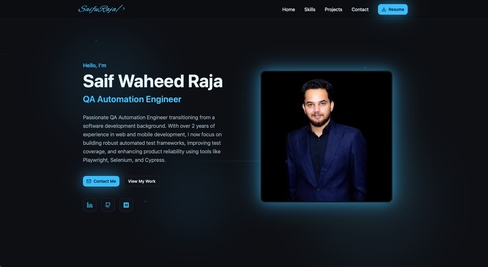
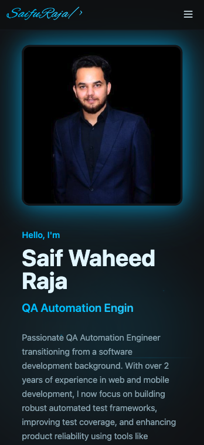
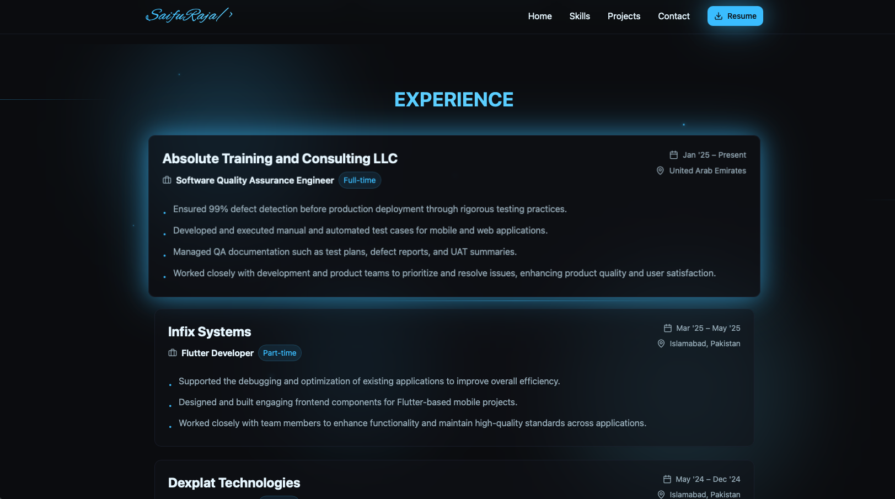

# QAfolio — Software QA Portfolio

A modern, responsive **Quality Assurance Portfolio** showcasing my work in **Manual & Automation Testing**, built with **React**, **TypeScript**, **Tailwind CSS**, and **Vite**.  
QAfolio highlights my testing projects, tools, workflows, and experience in ensuring high-quality, bug-free software products.

---

## 🌐 Live Demo

👉 [View Portfolio](https://saifu.me)

---

## ✨ Features

- ✅ Modern and responsive design  
- 🧪 Showcases QA projects (Manual & Automation)  
- 🧰 Tools, skills, and workflow sections  
- 🔍 Bug reports, test case design, and defect tracking samples  
- ⚙️ API testing and automation examples  
- 💬 Social links  
- 📄 Resume download  

---

## 📸 Screenshots

| Desktop | Mobile |
|----------|---------|
|  |  |

|  |

---

## 🚀 Tech Stack

- **Frontend:** React, TypeScript, Tailwind CSS  
- **Build Tool:** Vite  
- **Animations:** Framer Motion  
- **Icons:** Lucide, Heroicons  
- **Hosting:** Private  

---

## 🧩 QA Skills & Tools

| Category | Tools |
|-----------|-------|
| **Manual Testing** | Jira, TestRail, Trello |
| **Automation** | Selenium, Cypress, Playwright |
| **API Testing** | Postman, Rest Assured |
| **Languages** | Java, Python, JavaScript |
| **Version Control** | Git, GitHub |
| **CI/CD** | Jenkins, GitHub Actions |
| **Other** | Chrome DevTools, BrowserStack |

---

## 🧠 QA Focus Areas

- Functional, Regression & UI Testing  
- Test Case Design and Execution  
- API Validation & Automation  
- Defect Tracking and Reporting  
- Agile / Scrum QA Process  
- Continuous Integration Testing  

---

## 🛠️ Installation & Setup

```bash
# 1. Clone the repository
git clone https://github.com/SafuRaja7/qa-engineer-folio.git

# 2. Navigate into the directory
cd qa-engineer-folio

# 3. Install dependencies
npm install

# 4. Start the dev server
npm run dev
